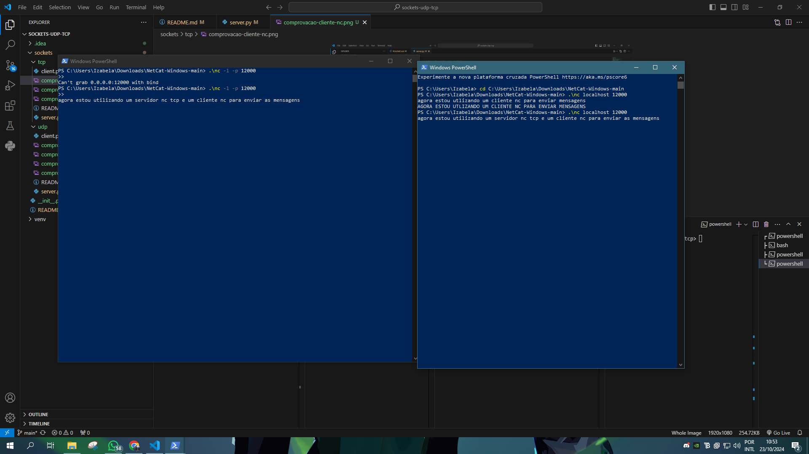
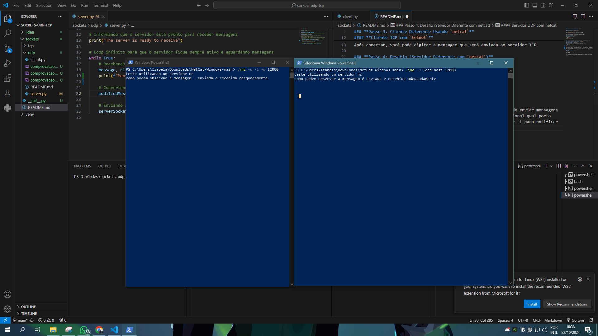

Aqui está uma versão atualizada do seu **README** explicando cada parâmetro dos comandos relacionados ao Netcat:

---

### **Passo 3: Cliente Diferente Usando `netcat`**

#### **Cliente UDP com `netcat`**
No terminal, execute o seguinte comando:

```bash
echo "mensagem em minusculas" | nc -u localhost 12000
```

#### Explicação dos Parâmetros:
- `echo "mensagem em minusculas"`: O comando `echo` é usado para enviar a string "mensagem em minusculas" como entrada.
- `nc`: Invoca o **Netcat** para estabelecer a conexão.
- `-u`: Especifica que será utilizada uma conexão **UDP**.
- `localhost`: Define o servidor ao qual o cliente irá se conectar. No caso, `localhost` significa que o servidor está rodando na mesma máquina que o cliente.
- `12000`: Define a **porta** onde o servidor está escutando.

Esse comando envia a mensagem "mensagem em minusculas" para o servidor UDP rodando na porta 12000.

#### **Cliente TCP com `telnet`**
Para TCP, use o **telnet**:

```bash
telnet localhost 12000
```

#### Explicação dos Parâmetros:
- `telnet`: Um utilitário para se conectar a servidores TCP.
- `localhost`: O servidor com o qual o cliente vai se conectar. No caso, `localhost` indica que o servidor está na mesma máquina.
- `12000`: A **porta** na qual o servidor TCP está escutando.

Após conectar, você pode digitar a mensagem que será enviada ao servidor TCP.

---

### **Passo 4: Desafio (Servidor Diferente com `netcat`)**

#### **Servidor UDP com `netcat`**
Substitua o servidor Python por um servidor UDP usando `netcat`:

```bash
nc -u -l -p 12000
```

#### Explicação dos Parâmetros:
- `nc`: Inicia o **Netcat**.
- `-u`: Indica que a conexão será **UDP**.
- `-l`: Coloca o Netcat no modo "listen", ou seja, ele ficará escutando por conexões na porta especificada.
- `-p 12000`: Define a **porta** na qual o Netcat escutará (neste caso, 12000).

Isso cria um servidor UDP escutando na porta 12000. Agora, você pode enviar mensagens com o cliente UDP.

#### **Servidor TCP com `netcat`**
Para TCP:

```bash
nc -l -p 12000
```

#### Explicação dos Parâmetros:
- `nc`: Inicia o **Netcat**.
- `-l`: Coloca o Netcat no modo "listen", para que ele escute conexões.
- `-p 12000`: Define a **porta** na qual o servidor estará escutando (neste caso, 12000).

Isso cria um servidor TCP escutando na porta 12000. Agora, qualquer cliente TCP pode se conectar e enviar mensagens.

---

### **Passo Extra: Usando Ncat para Comunicação Interativa**
Se você estiver usando **Ncat** em vez do **Netcat tradicional**, para rodar um servidor UDP ou TCP, a principal diferença é que você pode precisar usar o argumento `--send-only` em alguns casos, ou especificar corretamente a porta e o protocolo como já indicado.


### Comprovacao Servidor Diferente
#### TCP

### UDP
